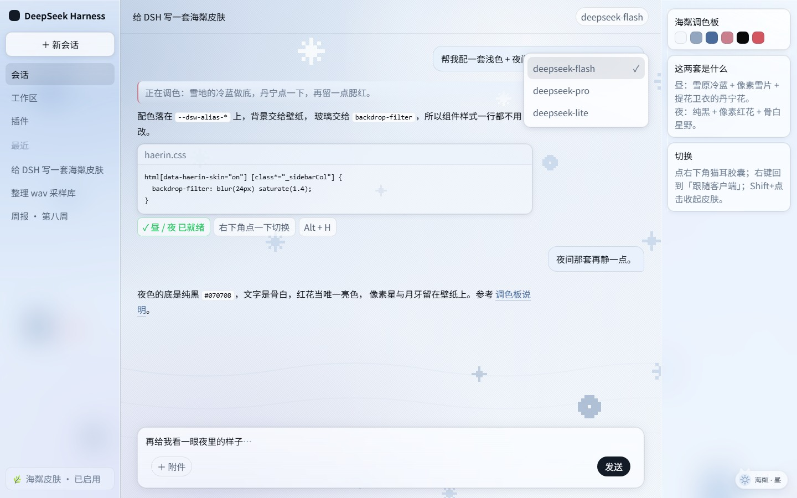
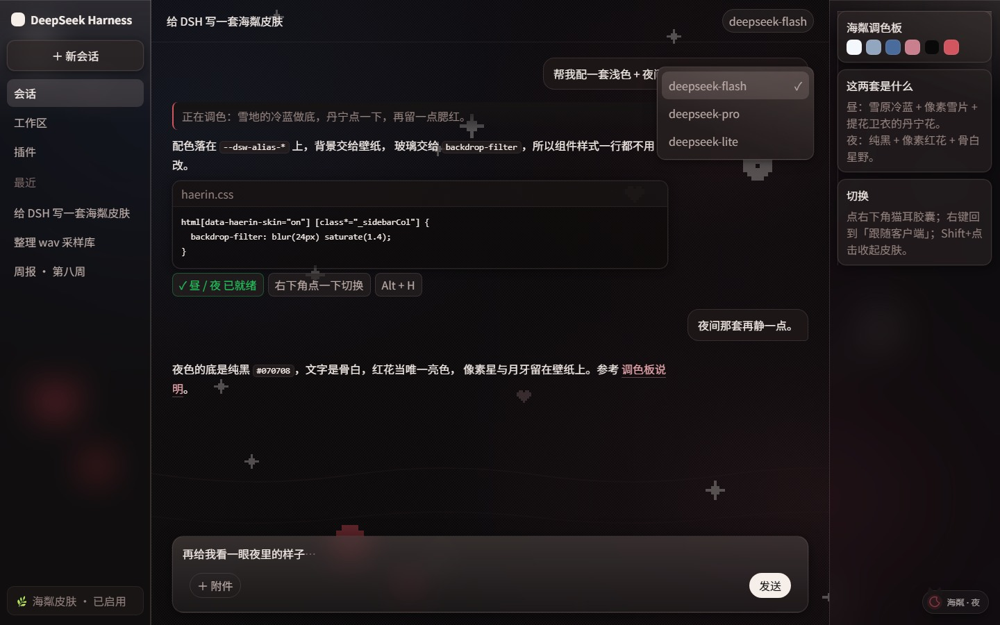
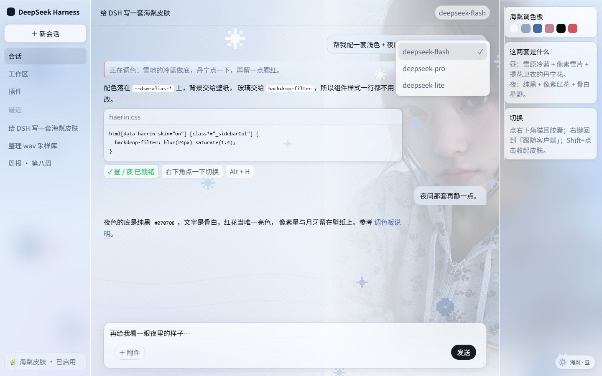
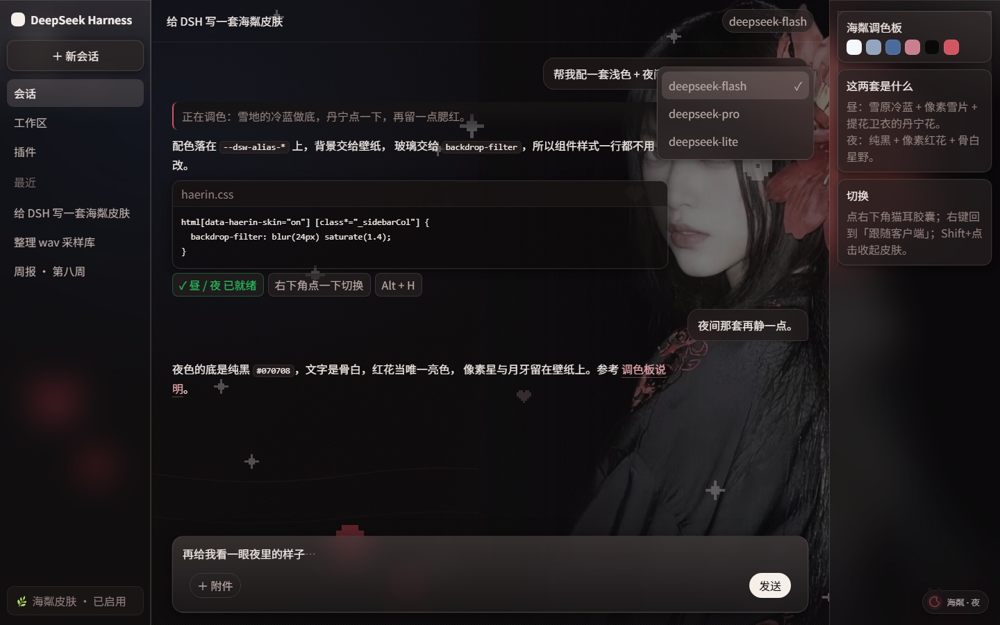

# 海粼 Haerin · DSH Skin

给 **DeepSeek Harness (DSH)** Web 客户端的一套皮肤：浅色 + 夜间两态，随时在客户端里切换。
配色取自 Haerin（해린）的两张照片——雪地的冷蓝与丹宁提花、墨黑里的胭脂红花——
背景层是原创矢量 + 像素拼贴，面板是磨砂玻璃。

[English](README.en.md) | 中文





上面是**不含照片**的默认效果（`--hj-wall` 里那一层缺文件就自动不画）。
把仓库里附的两张照片烘焙进去之后是这样：





> 照片底片随仓库附带，但**不属于 MIT 许可范围**，fork / 二次发布请自行替换或删除，
> 详见 [许可与声明](#许可与声明)。

> **只想要成品**：看下面「安装」。
> **想改成你自己的**（换色 / 换图 / 换开关 / 改名）：跳到
> [自定义指南](docs/CUSTOMIZE.md)——整套皮肤只有 3 个文件 + 一个素材目录，没构建步骤。

---

## 目录

- [安装](#安装)
- [怎么切换](#怎么切换)
- [里面有什么](#里面有什么)
- [自定义指南](#自定义指南)
- [仓库结构](#仓库结构)
- [工具](#工具)
- [预览页](#预览页)
- [原理速览](#原理速览)
- [已知边界](#已知边界)
- [许可与声明](#许可与声明)

---

## 安装

前提：Windows，已装 DSH Desktop。皮肤挂在前端 `dist` 上，**不改动任何插件**。

```powershell
git clone https://github.com/<you>/dsh-skin-haerin.git
cd dsh-skin-haerin
install.cmd
```

装完**让客户端界面重新加载一次**：托盘图标右键 →「重新加载界面」（或重启 DSH Desktop）。
之后窗口右下角会出现一只猫耳胶囊。

`install.cmd` 只是包了一层 `-ExecutionPolicy Bypass`，双击即可；等价的原生调用：

```powershell
powershell -NoProfile -ExecutionPolicy Bypass -File install.ps1 -Action install
install.cmd status      # 看装到哪了
install.cmd uninstall   # 摘掉引用块 + 删皮肤目录，index.html 逐字节还原
```

安装器做什么：

1. 自动找到本机所有 `@deepseek-ai/dsh-web-frontend/dist`（Profile 里那份 + 应用目录那份）；
2. 重建 `dist\skin\haerin\`（先删后建，旧素材不会残留），复制皮肤文件与 `art\`；
3. 在 `index.html` 的 `</head>` 前插入一个带标记的引用块（可重复执行，自动替换；
   首次备份 `index.html.haerin-orig`）。也可以用 `-DistPath` 手动指定目标。

### 手动安装（macOS / Linux，或不想跑脚本）

安装器只是省事，皮肤本身就是三个文件 + 一个素材目录：

1. 找到客户端的 Web 壳目录（`dist`）：
   - Profile 里那份（被真正加载的）：`~/.dsh/profiles/node_modules/@deepseek-ai/dsh-web-frontend/dist`
   - 应用自带那份（可选）：`<DSH Desktop>/resources/app/node_modules/@deepseek-ai/dsh-web-frontend/dist`
2. 把 `haerin-skin/` 整个目录复制成 `<dist>/skin/haerin/`
   （里面有 `haerin.css`、`haerin-boot.js`、`haerin.js` 和 `art/`）。
   如果 `art/` 里没有 `*-photo.jpg` 也没关系，缺文件那一层会自动不绘制。
3. 编辑 `<dist>/index.html`，在 `</head>` 之前加三行：

   ```html
   <link rel="stylesheet" href="./skin/haerin/haerin.css">
   <script src="./skin/haerin/haerin-boot.js"></script>
   <script src="./skin/haerin/haerin.js" defer></script>
   ```

4. 让客户端重新加载界面（托盘图标右键 →「重新加载界面」）。

**卸载**就是反过来：删掉这三行，再删掉 `<dist>/skin/haerin/` 目录。
两份 `dist` 都改或只改 Profile 里那份都行；DSH 升级后 `dist` 会被覆盖，重做一次即可。

## 怎么切换

| 动作 | 效果 |
| --- | --- |
| 左键点右下角胶囊 | 昼 ⇄ 夜（即时切换，记住选择） |
| 右键点胶囊 | 回到「跟随客户端外观」（跟着 DSH 自己的浅色/深色走） |
| Shift + 点击 | 收起皮肤（只剩一个小猫图标，再点回来） |
| 拖动胶囊 | 拖到任意角落，位置会记住 |
| `Alt + H` / `Alt + Shift + H` | 切换昼 / 夜 ／ 收起 / 打开 |

状态存在浏览器 `localStorage`（`haerin.skin` / `haerin.mode` / `haerin.pos`），刷新、重启都在。
控制台里也能直接驱动：

```js
haerinSkin.state      // { skin, mode, night, pos }
haerinSkin.day(); haerinSkin.night(); haerinSkin.auto();
haerinSkin.hide(); haerinSkin.show(); haerinSkin.toggle();
```

## 里面有什么

### 背景（5 层，画在 `<html>` 上，fixed，不随会话滚动）

| 层 | 昼 | 夜 |
| --- | --- | --- |
| 晕染底 | `day-mist.svg` 雪蓝天光 → 雪面近白 | `night-mist.svg` 近黑墨底 + 冷蓝 + 一点暖红 |
| 照片（可选） | `day-photo.jpg` | `night-photo.jpg` |
| 抖动网点 | `dither-day.svg` 4px 冷蓝网点 | `dither-night.svg` 4px 骨白网点 |
| 像素贴纸 | `day-pixel.svg` 8-bit 雪片、丹宁提花、腮红心 | `night-pixel.svg` 胭脂红花、骨白星、月牙 |
| 颗粒 | `grain.svg`（`feTurbulence`） | 共用 |

像素层是按 **NewJeans × 村上隆 × 飞天小女警**那套联名的 8-bit 拼贴感画的：图形都定义在
整数网格上、整数倍放大，配 `shape-rendering="crispEdges"`，所以边缘是硬方块而不是
抗锯齿曲线。左下的那只像素动物是故意压在侧栏底下的——栏内被磨砂糊成一块柔光、
栏外是清晰像素块，玻璃的厚度一眼就能看出来。

### 磨砂玻璃

表面 token 全部带透明度，玻璃靠 `backdrop-filter`，按厚薄分档：左栏与右栏 `blur(24px)`、
菜单/浮层/停靠条 `blur(30px)`、输入卡 `blur(20px)`、气泡 `blur(16px)`、模态遮罩 `blur(8px)`，
每块都带内高光与 1px 亮边。

结构选择器一律用 `[class*="_sidebarCol"]` 这种**后缀匹配**：DSH 客户端用的是带哈希的
CSS Module（`qNbT7G_sidebarCol`），哈希每次构建都会变，后缀才稳定。详见
[docs/CUSTOMIZE.md](docs/CUSTOMIZE.md) 与 [tools/client-selectors.md](tools/client-selectors.md)。

### 两套配色

| 角色 | 昼 | 夜 |
| --- | --- | --- |
| 页面底 | `rgb(246 250 255 / 18%)` | `rgb(10 9 10 / 26%)` |
| 层 1 / 2 / 3 | 白 `22% / 42% / 64%` | `rgb(22 19 19 / 30%)` `rgb(30 26 26 / 48%)` `rgb(39 33 33 / 66%)` |
| 侧栏 | `rgb(236 243 252 / 34%)` | `rgb(14 12 12 / 38%)` |
| 菜单 | `rgb(255 255 255 / 78%)` | `rgb(39 33 33 / 80%)` |
| 气泡 | `rgb(230 240 252 / 68%)` | `rgb(34 26 27 / 68%)` |
| 主 / 次 / 弱文字 | `#080C12` `#4F5D72` `#69798F` | `#F3EBE7` `#BCACA8` `#93817E` |
| 链接 | `#4A6C9C` 丹宁 | `#E8A7AD` 骨粉 |
| 品牌 / 主按钮 | `#131B26` | `#F5EEE9` |
| 强调 | `#C97F8E` 腮红 | `#D2555F` 胭脂 |

两套都从上游的三条**原色阶梯**重染出来：`--dsw-static-neutral-bluish-*`（雪灰蓝）、
`--dsw-static-deepseek-*`（丹宁）、`--dsw-static-neutral-*`（冷灰）。
夜色的暖色是**显式覆盖**的——同一条阶梯的暗端同时是白天的文字色，一条阶梯做不到一冷一暖。

---

## 自定义指南

整套皮肤**没有构建步骤**：`haerin-skin/` 下就是最终产物，改完重跑 `install.cmd` +
刷新界面即可。改什么、改哪里：

| 想改什么 | 打开 | 找什么 |
| --- | --- | --- |
| 整体色调 | `haerin-skin/haerin.css` | 两个模式块顶部的 `--dsw-static-*` 阶梯（各 19 级），整条换掉就换了全世界 |
| 强调色 / 链接 / 主按钮 | 同上 | 模式块里「语义层微调」那一段的 `--dsw-alias-brand-primary`、`-link`、`-new-color…` |
| 背景晕染 / 像素贴纸 / 网点 | `haerin-skin/art/*.svg` | 直接改 SVG；换文件就改 CSS 里 `--hj-wall` 那几行 URL |
| 放自己的照片 | `haerin-skin/art/` | 见 [art/README.md](haerin-skin/art/README.md)，用 `tools/prepare-photos.ps1` 烘焙 |
| 右下角开关的样子 | `haerin.css` 第 4 节 `.hj-*` | 自有命名空间，随便改；文案与图标在 `haerin.js` 顶部的 `LABEL` / `SVG` |
| 皮肤 ID / 名字 | 全仓库 | 搜 `haerin`：目录名、`data-haerin-*`、`.hj-`、`localStorage` 的 `haerin.*` 键 |

分步教程（换色示例、去掉照片、只留玻璃、改名 fork）写在
**[docs/CUSTOMIZE.md](docs/CUSTOMIZE.md)**。

## 仓库结构

```
dsh-skin-haerin\
├─ install.cmd / install.ps1    安装器：install / uninstall / status
├─ haerin-skin\                 皮肤本体（无构建步骤，改完直接用）
│  ├─ haerin.css                两套调色板 + 壁纸 + 磨砂 + 开关样式
│  ├─ haerin-boot.js            首帧引导（同步，放 <head>，防刷新闪白）
│  ├─ haerin.js                 开关：切换、跟随、拖动、快捷键、持久化
│  ├─ preview.html              离线预览页（照抄客户端类名，能真实切换）
│  ├─ art\                      晕染底 / 像素贴纸 / 网点 / 颗粒（+ 你自己的照片）
│  └─ _upstream\                上游 token 表，仅供预览页 1:1 还原
├─ docs\CUSTOMIZE.md            自定义与改名指南
├─ screenshots\                 两套配色的截图
└─ tools\
   ├─ prepare-photos.ps1        把自己的照片烘焙成背景底片
   ├─ extract-upstream.ps1      DSH 升级后重新抽取上游 token 与映射
   └─ client-selectors.md       客户端结构选择器备忘
```

## 工具

```powershell
# 把自己的照片做成背景底片（左缘淡出 + 罩色 + 轻微去饱和）
powershell -NoProfile -ExecutionPolicy Bypass -File tools\prepare-photos.ps1 `
  -Day "D:\pics\白天.jpg" -Night "D:\pics\夜里.jpg"
install.cmd

# DSH 升级后，检查上游 token / 映射有没有变化
powershell -NoProfile -ExecutionPolicy Bypass -File tools\extract-upstream.ps1 -Check
```

## 预览页

`haerin-skin\preview.html` 是一个不依赖客户端的模拟界面：类名照抄客户端的 CSS Module
后缀，所以 `[class*="_sidebarCol"]` 这些规则会被真实命中，磨砂与壁纸的观感和客户端一致。
直接双击打开、点右下角胶囊来回切：

```
preview.html?skinmode=night          显式夜间
preview.html?skinmode=auto&appdark=1 跟随客户端 + 客户端是深色
preview.html?skinmode=day&nohint=1   干净截图模式
```

## 原理速览

DSH 客户端的颜色全部走 `--dsw-*` 分层 token：`static-*`（原色阶梯）→ `alias-*` /
`specific-*`（语义）。皮肤做三件事：

1. **重染三条原色阶梯**；
2. **把上游两态的 `alias` + `specific` 映射逐条抄进自己的作用域**，指向重染后的阶梯；
3. **把表面 token 改成半透明**，壁纸画在 `html` 上，玻璃交给 `backdrop-filter`。

第 2 步是必须的：上游用 `body`（浅色）与 `body[data-ds-dark-theme]`（深色）分别决定
"某个语义 token 取阶梯的哪一端"。只改阶梯的话，当皮肤模式与客户端模式不一致时
（客户端浅色、皮肤选夜），语义层仍会去取浅色那端，文字就压在深色底上了。
映射也抄过来之后，皮肤两态各自完整、互不干扰，**组件样式一行都不用改**。

选择器形如 `html[data-haerin-skin="on"][data-haerin-mode="night"] body`，特异性高于上游，
因此与样式注入顺序无关；`haerin-boot.js` 在 `<head>` 里同步写好 `data-haerin-*`，
所以刷新不会先闪一下默认黑白。

## 已知边界

- **不是插件**：皮肤挂在前端 `dist` 上，DSH 客户端更新或重装 Profile 会覆盖 dist，
  重跑一次 `install.cmd` 即可（状态和素材都在）。
- **需要刷新一次**：Electron 渲染进程只在页面重新加载时读新的 `index.html`；
  之后所有切换都是即时的。
- **磨砂依赖 `backdrop-filter`**：Electron/Chromium 都支持；其它引擎下表面仍是半透明的，
  只是不会糊。
- **像素层是定尺寸的**：`1600×1000` 居中、不缩放（这样像素块才是硬的），
  窗口比它宽时边缘只剩晕染底；想换画幅改 `--hj-wall-size`。
- **`color-scheme`**：显式昼/夜时皮肤用 `!important` 压过宿主写在内联样式上的值，
  只为让原生滚动条、表单控件跟着走；auto 模式不声明。

## 许可与声明

- 代码与自绘矢量（`haerin-skin/haerin.*`、`haerin-skin/art/*.svg`）：**MIT**，见 [LICENSE](LICENSE)。
  拿去改成自己的皮肤、发布、商用都行，保留版权声明即可。
- `haerin-skin/_upstream/*.css`：从 `@deepseek-ai/dsh-client-ui-theme` 抽出的上游 token 表
  （MIT，© DeepSeek），只用于让预览页 1:1 还原客户端底色；皮肤运行时不依赖它。
  参见 [_upstream/README.md](haerin-skin/_upstream/README.md)。
- **照片不在 MIT 范围内**：`haerin-skin/art/day-photo.jpg`、`night-photo.jpg` 是第三方拍摄的、
  含真人肖像与品牌标识的素材，由维护者自行决定随仓库附带，**没有授权给你**。
  fork、二次发布或商用请先替换或删除它们（删掉文件即可，那一层会自动不绘制）。
  `LICENSE` 末尾有一段同样的例外说明。
- 本项目是粉丝向的第三方皮肤，**与 NewJeans / ADOR / HYBE 及 DeepSeek 均无关联**；
  除上述两张照片外不含任何官方素材。
